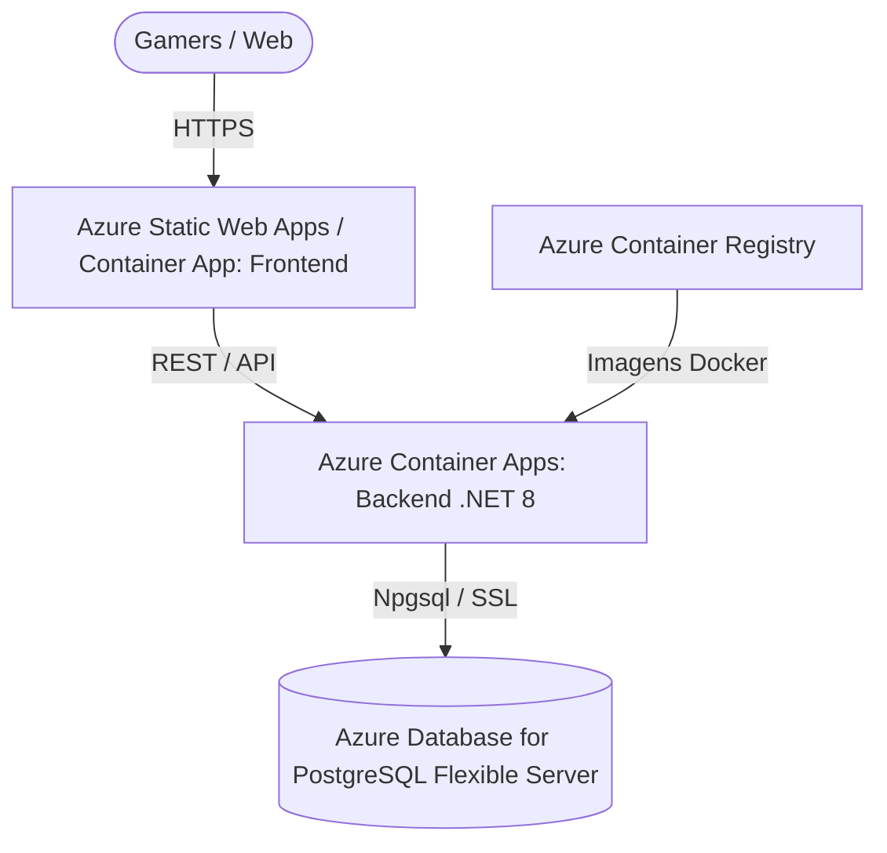

# ☁️ Guia Oficial de Deploy na Microsoft Azure — GameLog

Este guia orienta passo a passo o deploy de produção do **GameLog** na **Microsoft Azure** utilizando a arquitetura moderna recomendada:



---

## 🏛️ Arquitetura Azure Recomendada (Custo-Benefício & Escalabilidade)

| Componente | Serviço Azure | Tier Recomendado | Custo Estimado |
|---|---|---|---|
| **Banco de Dados** | Azure Database for PostgreSQL (Flexible Server) | `Burstable B1ms` (32 GB) | Grátis no 1º ano (Free Account) ou ~\$12-15/mês |
| **Backend API** | Azure Container Apps (Serverless Containers) | `Consumo Serverless (0.5 vCPU / 1GB RAM)` | Grátis até 180.000 vCPU-segundos/mês |
| **Frontend SPA** | Azure Static Web Apps ou Azure Container App | `Free Tier (Static Web Apps)` | **R\$ 0,00 (100% Gratuito)** |
| **Container Registry** | Azure Container Registry (ACR) | `Basic` | ~\$5/mês |

---

## 🚀 Passo a Passo de Implantação

---

### Passo 1: Pré-Requisitos
1. Uma conta na [Microsoft Azure](https://azure.microsoft.com/) (com créditos gratuitos ou assinatura Pay-As-You-Go).
2. [Azure CLI](https://learn.microsoft.com/en-us/cli/azure/install-azure-cli) instalada no seu computador (ou usar o Cloud Shell no navegador).
3. Efetue login no terminal:
   ```bash
   az login
   ```

---

### Passo 2: Definir Variáveis e Criar o Grupo de Recursos (Resource Group)

No PowerShell ou Bash:

```powershell
$RESOURCE_GROUP = "rg-gamelog-prod"
$LOCATION = "eastus2"   # East US 2 costuma ser uma das regiões mais baratas
$ACR_NAME = "acrgamelogprod" + (Get-Random -Minimum 1000 -Maximum 9999)
$PG_SERVER_NAME = "pg-gamelog-prod-" + (Get-Random -Minimum 1000 -Maximum 9999)
$DB_ADMIN_USER = "gamelogadmin"
$DB_PASSWORD = "SuaSenhaUltraSeguraAqui123!" # Troque por uma senha forte
$JWT_SECRET = "ChaveSecretaDePeloMenos32CaracteresParaOJwtToken!"

# 1. Criar o Grupo de Recursos
az group create --name $RESOURCE_GROUP --location $LOCATION
```

---

### Passo 3: Criar o Banco de Dados PostgreSQL Flexible Server

```powershell
# Criar servidor PostgreSQL (com extensão pg_trgm habilitada)
az postgres flexible-server create `
  --resource-group $RESOURCE_GROUP `
  --name $PG_SERVER_NAME `
  --location $LOCATION `
  --admin-user $DB_ADMIN_USER `
  --admin-password $DB_PASSWORD `
  --sku-name Standard_B1ms `
  --tier Burstable `
  --storage-size 32 `
  --version 16 `
  --database-name gamelog `
  --yes

# Permitir conexões de serviços internos da Azure (Container Apps)
az postgres flexible-server firewall-rule create `
  --resource-group $RESOURCE_GROUP `
  --name $PG_SERVER_NAME `
  --rule-name AllowAllAzureServices `
  --start-ip-address 0.0.0.0 `
  --end-ip-address 0.0.0.0
```

---

### Passo 4: Criar o Azure Container Registry (ACR) e Construir a Imagem

```powershell
# 1. Criar o ACR
az acr create `
  --resource-group $RESOURCE_GROUP `
  --name $ACR_NAME `
  --sku Basic `
  --admin-enabled true

# 2. Obter credenciais do ACR
$ACR_PASSWORD = (az acr credential show --name $ACR_NAME --query "passwords[0].value" -o tsv)
$ACR_SERVER = (az acr show --name $ACR_NAME --query "loginServer" -o tsv)

# 3. Fazer o Build da imagem da API diretamente na nuvem (sem precisar ter Docker local pesado)
az acr build --registry $ACR_NAME --image gamelog-backend:latest ./backend
```

---

### Passo 5: Executar o Script de Migração de Banco (`Migrations_Idempotent.sql`)

Conecte ao seu PostgreSQL na Azure e execute o script standalone:
```powershell
# Conectar via psql local ou ferramenta gráfica (DBeaver / pgAdmin / Azure Cloud Shell):
psql "host=$PG_SERVER_NAME.postgres.database.azure.com port=5432 dbname=gamelog user=$DB_ADMIN_USER password=$DB_PASSWORD sslmode=require" -f ./backend/Database/Migrations_Idempotent.sql
```

---

### Passo 6: Criar o Azure Container App para o Backend

```powershell
# 1. Criar o Ambiente de Container Apps
az containerapp env create `
  --name "env-gamelog-prod" `
  --resource-group $RESOURCE_GROUP `
  --location $LOCATION

# 2. Criar a API Backend
az containerapp create `
  --name "api-gamelog" `
  --resource-group $RESOURCE_GROUP `
  --environment "env-gamelog-prod" `
  --image "$ACR_SERVER/gamelog-backend:latest" `
  --target-port 8080 `
  --ingress external `
  --registry-server $ACR_SERVER `
  --registry-username $ACR_NAME `
  --registry-password $ACR_PASSWORD `
  --cpu 0.5 `
  --memory 1.0Gi `
  --min-replicas 1 `
  --max-replicas 5 `
  --secrets "db-pass=$DB_PASSWORD" "jwt-secret=$JWT_SECRET" `
  --env-vars `
    "ASPNETCORE_ENVIRONMENT=Production" `
    "DB_SERVER=$PG_SERVER_NAME.postgres.database.azure.com" `
    "DB_PORT=5432" `
    "DB_NAME=gamelog" `
    "DB_USER=$DB_ADMIN_USER" `
    "DB_PASSWORD=secretref:db-pass" `
    "JWT_SECRET=secretref:jwt-secret" `
    "FORCE_RESEED=false" `
    "CORS_ALLOWED_ORIGINS=https://gamelog.azurestaticapps.net,http://localhost:3000"
```

Obtenha a URL da API gerada automaticamente com HTTPS:
```powershell
$API_URL = (az containerapp show --name "api-gamelog" --resource-group $RESOURCE_GROUP --query "properties.configuration.ingress.fqdn" -o tsv)
Write-Host "API Backend Online em: https://$API_URL"
```

---

### Passo 7: Criar o Azure Static Web App (Frontend React Gratuito)

```powershell
# Criar o Static Web App apontando para o seu repositório GitHub
az staticwebapp create `
  --name "gamelog-frontend" `
  --resource-group $RESOURCE_GROUP `
  --source "https://github.com/pdr-rvr/GameLog" `
  --branch "main" `
  --app-location "/frontend" `
  --output-location "dist" `
  --login-with-github
```

---

### Passo 8: Atualizar a Variável CORS no Backend

Depois que o Static Web App for gerado e tiver seu endereço (ex: `https://white-beach-0123.azurestaticapps.net`), atualize o backend:

```powershell
$FRONTEND_URL = (az staticwebapp show --name "gamelog-frontend" --resource-group $RESOURCE_GROUP --query "defaultHostname" -o tsv)

az containerapp update `
  --name "api-gamelog" `
  --resource-group $RESOURCE_GROUP `
  --set-env-vars "CORS_ALLOWED_ORIGINS=https://$FRONTEND_URL"
```

---

## 🎯 Teste de Validação Final (Smoke Test)

1. Acesse `https://$API_URL/health` ➡️ Deve responder `Healthy`.
2. Acesse `https://$API_URL/health/ready` ➡️ Deve responder `Healthy` (banco conectado).
3. Acesse `https://$API_URL/metrics` ➡️ Deve exibir as métricas OpenTelemetry do Prometheus.
4. Abra a URL do Frontend no seu navegador ➡️ Navegue pelo catálogo e crie sua conta gamer!
